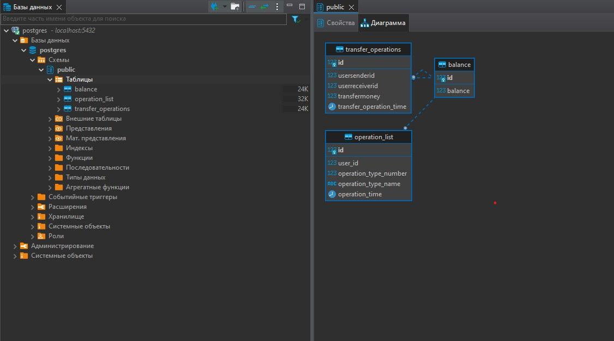

<h1>Latest-project_Banking-application
</h1>
 <h2>Описание приложения:</h2>
 
Приложение реализует Rest API по работе с банковским счетом. Это API может быть использовано банкоматом, веб-приложением или мобильным приложением Интернет-банка. 

  <h3>В приложении реализованы следующие типы операции:</h3>
  <ul>
     <li>Запроса баланса.</li>Метод /getBalance (Пример: http://localhost:9090/getBalance?id=1).
     <li>Снятие со счёта денежных средств.</li>Метод /putMoney (Пример: http://localhost:9090/takeMoney?id=5&money=200)
     <li>Внесения на счёт денежных средств.</li>Метод /putMoney (Пример: http://localhost:9090/putMoney?id=3&money=5000)

  </ul>
   Ответ выдается в виде JSON.
  <h3>Для работы приложения необходимо:</h3>
      <li><a href="https://www.postgresql.org/download/">Database PostgresSQL</a></li>
      <li><a href="https://www.oracle.com/java/technologies/downloads/">Java 11</a>( или более поздней версии) </li> 
       <h3>Запуск приложения:</h3>
       <li>Запустить dump-файл на своей локальной postgres БД</li>
<li>Изменить настройки подключения к локальной БД в файле application.properties</li>
<li>Запустить файл FinalProjectApplication.java</li>
<h3>Cкриншот структуры базы данных:</h3>
